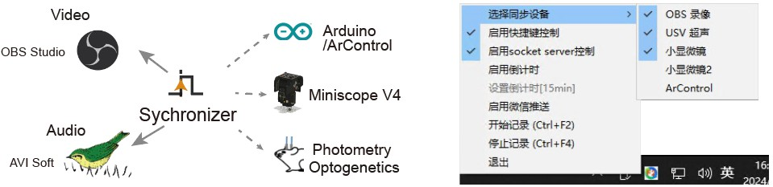
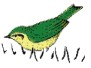
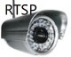
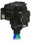
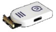
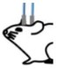
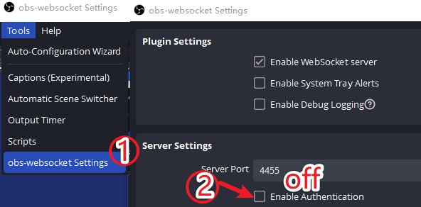
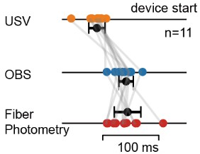

# F2 同步助手

> 在神经科学领域，光遗传刺激系统、光度测量系统和活体电生理记录系统等也被广泛使用。这些系统在硬件结构和软件使用上存在差异，实现它们之间的时间同步是一个亟待解决的问题。


## 实现功能
多个数据采集设备同步“开始”和“结束”数据采集，避免数据采集时间不同步。时间差在 100ms 以内。


## 已支持的设备（持续更新）

|                     设备                     | 功能                                                         |
| :------------------------------------------: | ------------------------------------------------------------ |
|  OBS 录像  | 利用麦克风，录制相机和麦克风的视频                           |
|   USV超声    | 利用 [AVISoft-Bioacoustics](https://avisoft.com/price-list-ordering-information/) 录制高频声音 |
| ArControl  | 检测和控制动物行为训练，如Go/No-GO, 舔水，光遗传等           |
|   Arduino    | 单片机用于给予 TTL 同步刺激                                  |
| 监控相机  | RTSP 协议的网线监控相机（海康威视）， 多路高清视频录制。         |
| 小显微镜 | [UCLA miniscope V4](https://open-ephys.org/miniscope-v4/miniscope-v4) 显微成像。 |
| 无线电生理 | [宁矩科技](http://www.neuramatrix.com.cn/) STD1.0 无线多通道LFP采集，EPStudio |
| 光纤记录  | 光纤钙信号、探针信号记录系统。实验室自定义代码。             |


## 使用方法

| 功能       | 数据采集开始                                       | 数据采集结束        |
| ---------- | -------------------------------------------------- | ------------------- |
| 界面操作   | 按下“开始记录”                                     | 按下“结束记录”      |
| 全局快捷键 | Ctrl + F2                                          | Ctrl + F4           |
| 网络操作   | $ nc -q 1 localhost 20169 < <(echo "start_record") | $ ... "stop_record" |


## 如何安装软件

客户端软件仅支持 Windows X86 平台

```bash
$ conda create -n f2_sync python=3.10
$ conda activate f2_sync
$ pip install -r requirements.txt
$ python f2_sync.py
```


## 配置各个设备 (持续更新)

### 1. OBS 录像

打开OBS Studio 软件，在`菜单栏 > Tools > obs-websocket Settings` 功能中，找到`Server Settings`，取消其中的 `Enable Authentication`。
<p align="center">
  
</p>

### 2. USV超声
需要开启 USV 时，提前将 `项目/bin/` 文件夹里的东西拷贝到Windows 搜索路径下（推荐 `C:\Windows\System32`）

### 3. ArControl
打开ArControl Recorder，点击激活 `菜单栏 > Tool > Socket`，获取端口号。默认为 `20171`，不可修改。同步助手通过ArControl的socket后台操控设备运行。

### 4. Arduino TTL tagger

进入`项目/plugin_Arduino_TTL_tagger/` 文件夹，将 `arduino/arduino.ino` 的源码烧录到Arduino板。然后运行 `plugin_Arduino_TTL_tagger/main.py`。同步助手在“开始”和“结束”采集时，会触发 Arduino板 `D12` 端口单次闪烁，或连续两次闪烁，作为 TTL 的 tag。

### 5. UCLA 小显微镜

使用本人修改过的 UCLA Miniscope [记录软件](https://github.com/Aharoni-Lab/Miniscope-DAQ-QT-Software/pull/56)。打开 socket 后台。同步助手通过socket后台操控设备运行。

### 6. 宁矩科技无线电生理
进入`项目/plugin_epstudio_ephys` 文件夹，运行 `main.py`。同步助手通过socket后台操控设备运行。需要向宁矩科技购买设备，并安装 `epstudio_sdk python`。


## 同步的时间精度

基于软件的同步方案，受到操作系统状态和设备的性质影响。不同的设备启动的“热身时间”不一致，越繁重的设备，启动越慢。通常 ArControl/Arduino 的启动速度最快，在20 ms 以内；OBS 和 UCLA小显微镜启动最慢，在200ms 左右。设备多次启动，variation通常在 ±50 ms 以内。

<p align="center">
  
</p>


## 快速实现自己的设备定义
参考 `f2_slaves.py` 文件，`plugin_xxx/main.py`，实现自己的设备定义。通过仿造plugin 示例中 socket 后台编程的范式，实现目标设备的`start_record` 和 `stop_record` 两个函数。